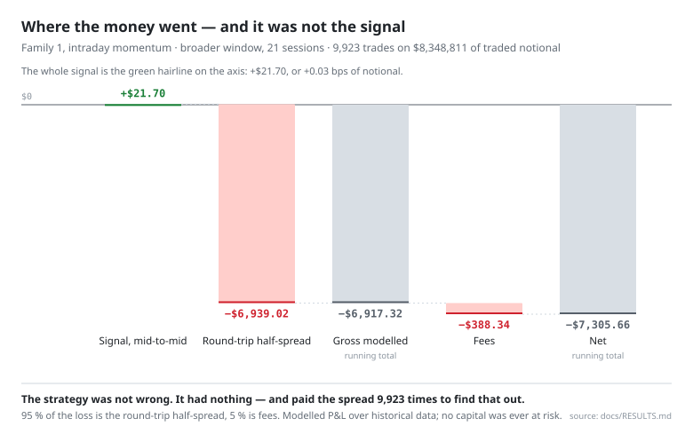

# Results: two strategy families, both nulled

This is the negative-results document. It reports two hypotheses that were written down, tested against
criteria fixed in advance, and rejected on those criteria — followed by the stop rule that ended the search.

Nobody publishes these. That is exactly why the same dead strategies keep getting rebuilt: the file-drawer
problem, applied to trading. The measurements below cost real time and real data spend, and they are more
useful to a reader than another repository claiming an edge.

**Every profit-and-loss number here is modelled, not realised.** It is produced by a simulator over historical
vendor data and is typed `ModeledUSD` in the code precisely so it can never be mistaken for broker money. No
position in this document was ever held with real capital. Money lost in the market: **$0**.

---

## The criteria, fixed before the runs

The pass thresholds are constants in `scripts/agent/backtest_gate.py` (lines 88–95). They are floors: an
individual research packet may make them *stricter*, never looser, and the verifier refuses an artifact whose
thresholds are weaker than the pinned ones.

| Gate | Threshold | Why it exists |
|---|---|---|
| `min_sessions` | ≥ 20 | A result on five days is not a result |
| `min_trades` | ≥ 30 | Same |
| `min_traded_sessions` | ≥ 5 | Prevents one lucky day carrying the sample |
| net P&L | > 0 | Execution-realistic, after fees |
| active P&L | > 0 vs **both** benchmarks | Beating a falling market by falling less is not an edge |
| `avg_trade_bps` | > 0 | The average trade must make money |
| `profit_factor` | ≥ 1.10 | Gross wins / gross losses, with a margin |
| `max_drawdown_pct_allocated` | ≤ 1.50 % | Risk gate |
| `worst_day_pct_allocated` | ≤ 0.75 % | Risk gate |
| `p95_realism_gap_bps` | ≤ 15 bps | **Execution friction.** The 95th-percentile gap between a trade's modelled P&L and the same trade priced mid-to-mid. This simulator fills at the touch, so the gap *is* the round-trip half-spread |
| `max_single_fill_divergence_bps` | ≤ 50 bps | The worst single *trade* on that same round-trip measure. Despite the name it is not a per-fill number |

The last two matter most, and most backtests do not have them. Be precise about what they are. This simulator
already pays the spread — it buys at the ask and sells at the bid — so the P&L above is spread-inclusive, and
failing these caps does *not* mean the P&L was inflated. What the caps bound is the **friction a result is
allowed to depend on**: with touch fills the gap reduces algebraically to the round-trip half-spread of the
trades the strategy actually took (`_realism_gap_bps`, `scripts/agent/backtest_historical.py`). So they encode
a liquidity requirement, fixed in advance: pay more than 15 bps at the 95th percentile to get in and out and
the result does not count, however good the P&L looks — because at that width the touch-fill assumption is
itself the fragile part (size at the touch, queue position, a one-minute snapshot).

Two benchmarks are required, not one: an **exposure-matched** benchmark (`exposure_matched_midbar_v1`, same
capital deployed at the same times) and an **equal-weight long basket** of the universe
(`universe_equal_weight_long_v1`). Both must be beaten. This closes the most common self-deception in
cross-sectional work: picking the benchmark after seeing which one you beat.

---

## Family 1 — intraday momentum (`directional.momentum_v1`, `momentum_v2`)

**The hypothesis.** Short-horizon price continuation is detectable in top-of-book data and survives execution
costs.

**The substrate.** Databento `EQUS.MINI` `bbo-1m` — Level 1 top-of-book, one-minute bars. Decisions on the
minute bar; entry one minute after the decision with a 250 ms quote-latency budget; **exit 5 minutes after
entry** (`horizon = config.horizons[0]` = `5m`, `scripts/agent/backtest_historical.py`; the horizon list is in
`config/agent_rules.json`). Universe: 10 US large-caps — AAPL, AMZN, AVGO, COST, GOOGL, META, MSFT, NFLX,
NVDA, TSLA. Long-only.

**What was measured.** Three staged runs, none promoted:

| Run | Trades | Net (modelled) | Active vs benchmark | Symbols passing |
|---|---|---|---|---|
| Broader window, 21 sessions | 9,923 | **−$7,305.66** | −$4,571.72 | **0 of 10** |
| Same window, after causal-time hardening | 9,923 | −$7,305.66 | −$4,571.72 | **0 of 10** |
| Non-overlapping holdout, 22 sessions | 11,368 | **−$6,918.83** | −$5,183.91 | **0 of 10** |
| `momentum_v2` diagnostic, 10 symbols | 1,428 | −$409.06 | −$142.17 | — |

Profit factor ranged from **0.001 to 0.71** across symbols in the holdout and **0.05 to 0.54** in the broader
window — every one below the 1.10 floor, most far below. In the holdout, realism gaps ranged from a p95 of
3.3 bps up to **84.3 bps** depending on the name, against a 15 bps cap, and single-fill divergence reached
**460.8 bps** against a 50 bps cap. The broader-window review publishes neither of those two columns, so they
are holdout figures rather than a range across both gated runs.

**What killed it.** Every symbol, in both gated windows, failed on net P&L, active P&L, profit factor and
average trade — ten of ten, twice, with no exceptions. The realism caps bit hard but not universally: the
15 bps p95 gap cap was blown on 6 of 10 symbols in the broader window and 7 of 10 in the holdout, and the
50 bps single-fill cap on 9 of 10 and 10 of 10 respectively. There was no marginal call to make.

**The cost decomposition** (broader run, 9,923 trades on $8,348,811 of traded notional). These figures were
re-derived for this document by re-running the committed harness over the staged quote files; it reproduced
every symbol's staged net P&L to the cent:

```
mid-to-mid over the hold      +$21.70   ← the signal, marked frictionlessly: +0.03 bps of notional
round-trip half-spread     −$6,939.02   ← paid on entry (at the ask) and on exit (at the bid), 9,923 times
                           ----------
gross modelled             −$6,917.32
fees                          −$388.34
net                        −$7,305.66
benchmark (matched)        −$2,733.94   ← mid-marked from the decision, frictionless; the basket fell
active vs benchmark        −$4,571.72
```

<picture>
  <source media="(prefers-color-scheme: dark)" srcset="assets/cost-decomposition-dark.svg">
  
</picture>

Fees are only 5.3 % of the loss — but fees are not the friction that mattered. The strategy buys at the ask and
sells at the bid; the benchmark is marked mid-to-mid and pays nothing. Marked that same frictionless way, the
signal earned **+$21.70 on $8.35 M of traded notional — 0.03 bps, indistinguishable from zero.** The whole
−$7,305.66 is the round-trip half-spread (95 %) plus fees (5 %).

The active gap is the same story rather than a second one. Over the holding period both legs carry the same
quantity, so the direction of the trade cancels out of `net − benchmark`; what survives is the one-bar
decision-to-entry drift (**+$2,755.64**, in the strategy's favour) minus the half-spread and fees:
`+2,755.64 − 6,939.02 − 388.34 = −4,571.72`. So the $4,572 is not evidence that the strategy was directionally
wrong — by construction that number cannot carry such evidence. The honest reading is duller and harsher:
there was no edge to eat, and the cost of crossing the spread ate it anyway.

(Same identity as the realism gap above: `_realism_gap_bps` measures exactly this round-trip half-spread, which
is why the caps and the P&L fail for one reason rather than two.)

**Honest caveat about predeclaration.** Family 1's pass *criteria* were pinned in a committed contract before
any run was reviewed. Its 10-name *universe* was not: the first committed appearance of the universe list is
the failure review that reports the broader run. The universe was not chosen to flatter the result — the
result was a null on all ten — but the predeclaration was incomplete, and later packets were tightened to
hash-bind the universe into the manifest precisely because of this gap. Recording the weakness is the point.

---

## Family 2 — intraday cross-sectional relative strength (`relative_strength.long_only_proxy_v1`)

**The hypothesis.** Even if absolute direction is unpredictable at this horizon, *relative* strength across a
universe may be — the standard argument for cross-sectional work. This was run as a long-only **proxy** first:
a cheap probe of whether any cross-sectional residual signal exists at all, before building the expensive
market-neutral short side. That sequencing was itself predeclared, with a written Phase Gate.

**The predeclaration.** `docs/superpowers/specs/2026-06-13-M7c-relative-strength-research-packet.md`, reviewed
and approved before the run. Same L1 one-minute substrate, same 10-name universe, top-2 long by
cross-sectional rank, 30-bar horizon, no overlapping positions per symbol, both legs aggregated under one
artifact, both benchmarks gated.

**The window.** 2026-03-10 → 2026-04-08, 21 sessions — the packet's preferred **clean** window, chosen because
no relative-strength metric had ever been computed on it. That matters: it was not a window that had already
been looked at.

**What was measured** (staged run summary, `reports/m7_historical_runs/2026-03-10-clean-rs-v1/`):

| Metric | Measured | Threshold | |
|---|---|---|---|
| Trades | 1,144 | ≥ 30 | pass |
| Sessions / traded sessions | 21 / 21 | ≥ 20 / ≥ 5 | pass |
| Symbols traded | 10 of 10 | — | broad |
| Max drawdown | 0.87 % | ≤ 1.50 % | **pass** |
| Worst day | 0.11 % | ≤ 0.75 % | **pass** |
| Net P&L (modelled) | **−$839.68** | > 0 | **FAIL** |
| Active vs exposure-matched | **−$120.65** | > 0 | **FAIL** |
| Active vs equal-weight basket | +$405.64 | > 0 | pass — *see below* |
| Average trade | **−8.78 bps** | > 0 | **FAIL** |
| Profit factor | **0.55** | ≥ 1.10 | **FAIL** |
| p95 realism gap | **29.82 bps** | ≤ 15 | **FAIL** |
| Max single-fill divergence | **97.48 bps** | ≤ 50 | **FAIL** |

<picture>
  <source media="(prefers-color-scheme: dark)" srcset="assets/criteria-vs-measured-dark.svg">
  
</picture>

The `+$405.64` against the equal-weight basket is the trap the two-benchmark rule was written to catch: it
does not mean the strategy made money. It means **the basket lost more**. Against the benchmark that actually
controls for deployed capital, the strategy was $120.65 worse. A single-benchmark version of this study would
have reported a positive number.

**Breadth.** The null is broad, not an artifact of one name: all 10 symbols traded, the largest single symbol
was 12.3 % of gross legs and 16.8 % of net-positive P&L — well inside the 35 %/50 % concentration limits. It
is not one bad ticker dragging down nine good ones.

**The risk gates passed.** Drawdown and worst-day were comfortably inside their caps. The system was not
dangerous; it was simply not profitable. Those two things are separable and this document keeps them separate.

---

## The cost decomposition that actually generalises

Family 2's loss splits in the same direction as family 1's, in different proportions. Of the $839.68 lost,
only **$120.65 (14 %)** is underperformance against the matched benchmark; the rest is the direction of the
market over the window. Family 1's active share is larger only because it traded nearly ten times as often, and
so crossed the spread nearly ten times as often. Neither family actively destroyed value — both paid a friction
bill that neither had an edge to cover.

What killed it was the **realism caps**, and a later measurement showed why that was structural rather than
bad luck. Decomposing the modelled execution gap into its entry and exit legs on the 1,147-trade
fix-A-compliant baseline (measured 2026-07-02, documented in
`docs/superpowers/specs/2026-06-26-M7d-longer-horizon-research-packet.md` §Evidence Grounding):

```
entry-leg half-spread, p95, all trades          13.27 bps   ← 88 % of the entire 15 bps cap
entry-leg half-spread, p95, 120m-hold subset    14.13 bps   ← 94 % of the cap
exit leg adds, p95                            ≈ 20    bps
combined gap, p95, that subset                  31.67 bps   ← 2.1× the cap
max entry-leg half-spread                     ≈ 85.8  bps   ← exceeds the 50 bps cap on its own
```

Read that against family 2's average trade of **−8.78 bps**. The cost of getting in — before any question of
whether the signal is right — is on the same order as everything the strategy could plausibly earn. And the
entry leg is **horizon-invariant**: holding longer does not shrink it, because you still pay it once on the
way in.

**This is the generalisable finding.** Not "these two strategies were bad", but: *on Level-1 one-minute data,
in a 10-name large-cap universe, the round-trip half-spread is about twice the execution-realism budget these
criteria allow.* Any strategy on this substrate has to overcome a friction floor that is not a modelling
artifact and does not go away with a better signal. You are in a speed contest you have not been equipped for
— and the measurement, not an opinion, is what says so.

---

## The experiment that was predeclared and never run

The stop rule (below) permitted a **substrate** change rather than a third strategy on the same substrate.
The chosen change was a longer holding horizon — cheapest, reuses the existing harness, and attacks both the
edge question and the realism-cap failure at once. It was fully predeclared as `M7d`
(`docs/superpowers/specs/2026-06-26-M7d-longer-horizon-research-packet.md`, revision 3 after an external
cross-model review), with a fresh 20-session holdout as the sole decider and the criteria unchanged.

**It was never run.** The packet's own pre-run feasibility measurement — the entry-leg floor above — showed
that a pass was structurally improbable: clearing the 15 bps cap would have required the fresh window's spread
regime to be roughly *half* the measured one. Formally reachable, structurally unlikely.

It is recorded here as predeclared-and-unrun rather than quietly dropped, because a research packet that
disappears without a result is how selective reporting starts. The honest status is: **the experiment was
designed, its feasibility was measured, the measurement said the odds were poor, and the line was stopped
before spending on it.**

---

## The stop rule, and what it forbade

Two rules were written, on two different dates, and the dating is the point — so both are quoted verbatim and
dated rather than merged.

**Pinned 2026-06-13, thirteen days before family 2 ran** (and the same evening family 2's first line of code
landed). `PLAN.md`, the search-budget stop rule:

> the strategy search is allowed at most **two** distinct predeclared (strategy, universe) families on a fixed
> data substrate (the L1 `EQUS.MINI` 1-minute top-of-book mega-cap substrate) before a substrate-level decision
> is forced. […] If family 2 produces a broad reviewed null, the next decision is NOT a third same-substrate
> family — it is an explicit substrate decision (a longer decision/holding horizon, an L2/MBP-10 depth-aware
> fill tier, or a wider liquidity-screened universe) or a documented stop. No-edge on a fixed substrate is a
> substrate conclusion, not an invitation to keep reskinning the strategy.

And, in the same commit, the family-2 research packet's Phase Gate:

> The next decision is then a SUBSTRATE decision — a longer decision/holding horizon, an L2/MBP-10 depth-aware
> fill tier, or a wider liquidity-screened universe — or an explicit stop. It is NOT "start a sixth strategy
> family on the same L1 1-minute substrate," and it is NOT the phase-2 short-side build.

**Added 2026-07-02, after family 2's null**, bounding the substrate axis itself. It is pre-registered with
respect to what it governs — no substrate experiment had run, and none ever did — but it was *not* written
before family 2, and it is not the clause that fired:

> **Substrate-search budget (predeclared 2026-07-02):** […] at most **two** predeclared substrate experiments
> on the current relative-strength family line before a **documented program STOP** of the autonomous edge
> search. […] A second substrate null ends the program: any continuation […] requires a fresh explicit mandate
> […], not a routing rule.

Both families nulled, and the rule that fired was the first one — on the record thirteen days before the run.
Nothing was promoted; `artifacts/backtests/` still contains only `.gitkeep`, which is why the S9 gate blocks
every real-strategy open to this day.

The part worth copying is the **negative clause**. A stop rule that only says "then stop" is trivially evaded
by redefining what you were doing. This one named the two specific follow-ups that would have felt most
natural — build the short side, try one more variant — and forbade them in advance, while the outcome was
still unknown and the temptation did not yet exist.

**What these nulls do not prove.** They null *tested configurations*, not the underlying ideas. Momentum was
tested at a 5-minute hold on L1 one-minute bars in ten large-caps. Relative strength was tested long-only at a
30-bar horizon in the same ten names. Neither result isolates the substrate from the horizon, the universe, or
the strategy shape — those are confounded, deliberately, because separating them would have cost more than the
answer was worth. The decision to stop follows from the **budget rule**, not from a proof that the substrate
is the binding constraint. Claiming more than that would be the same overreach this project was built to avoid.

---

## Reproducibility, honestly

You cannot re-run these numbers, and it is worth being precise about why.

The inputs are Databento and Alpaca market data. That data may not be redistributed, so the recorded quotes,
the run directories and the artifacts are all git-ignored and are not in this repository. The **method** is
fully public: the harness, the criteria, the manifest builder, the hash-binding, the verifier and every
threshold are committed and tested. Given your own vendor entitlement, the pipeline that produced these
numbers is committed too.

This is a deliberate trade. A repository that shipped the data would be more checkable and would also be a
licence violation. What is published instead is everything that makes the numbers *auditable in method*: what
was declared, when it was declared, what was hash-bound to what, and what the gate refused.

The diagnostic exporter is contractually forbidden from embedding raw vendor rows into any committable file,
and that prohibition is itself enforced by tests
(`tests/agent/test_m7_historical_artifact.py`). The repository publishes methodology and aggregates, never
vendor rows — by construction, not by convention.

---

## Chapter: the same method in a different market

Before the equities work, the same discipline was applied to **prediction markets** in a separate research
workspace — an observe-only paper agent on Polymarket. That workspace is not published: it has no conclusion
to publish. Two documents from it are reproduced here, in `docs/method/`, because they are evidence that the
method is not equities-specific.

**This is not a third null. It is a line that was stopped without ever reaching a verdict.** Say it plainly,
because dressing up an unfinished project as a result would undercut everything else in this document.

What it actually produced: **15 committed decisions — 11 `do_nothing`, 4 `watch`, zero opens** — with an empty
`resolutions.jsonl` (0 bytes). Five paper positions were opened in runtime state outside that journal, of which
two resolved for **+$8.20** of *optimistic* paper P&L; the workspace's own audit classifies all five as
`optimistic_only`, `execution_realistic=0`, because they predate its execution-realism gate. In other words:
even the one positive number it produced does not clear its own realism bar. A sample of two resolutions is
not evidence of anything.

The two harvested documents:

- **[`docs/method/critique-of-the-polymarket-bot-plan.md`](method/critique-of-the-polymarket-bot-plan.md)** — an
  adversarial review, translated from Danish, that dismantles the project's own edge definition before the
  project was built. It kills one of four candidate edges outright, declares a second nearly dead, calls the
  project's logging schema structurally wrong, and calls its headline trading rule flatly incorrect. Its
  central argument is a category error worth generalising: **single-token edge and constraint edge are
  different objects**, and treating them as one produces a decision log that records edge which does not
  exist. The specific finding — that only `negRisk=true` events create a real mechanical binding between
  outcomes, so the sum of prices across a merely *visually grouped* event means nothing — is exactly the kind
  of domain detail that separates a real constraint from a plausible-looking one.
- **[`docs/method/sports-clv-edge-lab-kill-criteria.md`](method/sports-clv-edge-lab-kill-criteria.md)** —
  predeclared kill rules for a closing-line-value measurement lab, written before the lab ran. Five numbered
  conditions that end it, a "the lab is allowed to find no edge" clause, and an explicit non-goal:
  *"No threshold lowering to create activity."* Same shape as the equities stop rule, a different market.

There is a detail in the pairing that is easy to dress up, so state it carefully. The critique's sample-size
section quotes "15 decisions" and calls it almost zero information — and 15 was the count already standing in
the workspace's decision journal on the day the critique was written. That is a description of the state in
front of the reviewer, not a prediction. What is worth a line is what happened next: the count never moved. The
workspace kept building for another two months — a paper agent, a sports CLV lab, an execution-realism gate —
and never added a sixteenth comparable decision to the journal the critique was criticising.

**On the shared root cause — stated carefully.** It is tempting to say both lines died of the same thing:
per-trade friction in a speed contest. The equities side **measured** that: an entry-leg half-spread floor at
88–94 % of the entire realism budget, horizon-invariant. The Polymarket critique **reasoned** its way to a
structurally similar conclusion — that the visible 2-percentage-point gross on liquid sports futures is
"almost entirely spread, fee, inventory, resolution risk and capital lockup", that the binary-parity edge is
"often 0 after execution", and — from the NBA study it cites — that only 7 executable single-market in-game
anomalies were found, with a median duration of 3.6 seconds, and that 76.9 % of its 290 combinatorial episodes
were limited to an average of 14.8 shares of executable size.

That is a genuine convergence, and it is worth noting. But it is one line that measured its friction and one
line that predicted its friction and then stopped before testing the prediction. Two independent arguments
pointing the same way is not two independent measurements, and this document will not upgrade it into one.

---

## What the whole programme is worth

Stated as assessment, not fact.

The most likely outcome of a programme like this is an honest "there is no measurable edge here — buy the
index". Few people reach that conclusion honestly, and reaching it cheaply has value: it prevents losses. On
this programme's own ledger, that is its largest financial contribution to date — **$0 lost in the market, two
strategy families rejected on their own measurements rather than traded blind.**

Two things determine whether work like this can ever pay. The first is **capital scale**: two percent a year on
a small account is a rounding error against the hours it costs, and only makes financial sense at real scale or
across decades of compounding. The second is **where any upside would actually live** — almost certainly not in
a factor strategy that is public and crowded, but in reading breadth no human can match across sources nobody
bothers to read carefully at small size. That remains untested here.

The defensible posture, then: keep it cheap, let predeclared clocks run, judge on evidence at dates fixed in
advance, and scale neither time nor money before there is forward evidence. Plan no livelihood on it. The
realistic best case is a few points of discipline-driven advantage. The most likely case is an honest "no",
found cheaply — which is what this document is.
